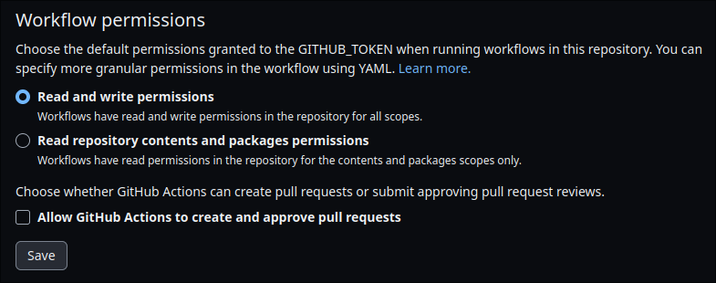
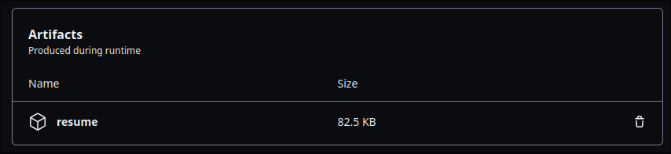

# Leverage Markdown and GitHub to Manage Your Resume with Resume-md
Many developers are very familiar with benefits of markdown. It has a simple
syntax which makes it easy to learn, read, and write. It's also very easy to
version control and with a tool like `Pandoc`, can be combined with `css` to
build stylized outputs in multiple formats like PDF and HTML.

This, combined with GitHub Actions and GitHub Pages can be leveraged to
automatically build a stylized PDF for download, and deploy a stylized HTML as
a static web page.

## Resume-md
[`Resume-md`](https://www.github.com/siph/resume-md) is a project
that automates resume management and does all these things for you.

### How To Use
- Generate a new project using
  [`resume-md`](https://www.github.com/siph/resume-md) as a template.  
  

- **Make sure to include all branches**.  
  

- Enable read/write workflow permissions.  
  

- Edit `resume.md` and push commits. Optionally, you can also edit
  `style.css`.

- Once finished, download your PDF/HTML from the `Actions` tab.  
  

- The HTML is automatically deployed to
  `https://<your-github-username>.github.io/<repository-name>`

## Conclusion
This approach has a lot of benefits especially to developers who are already
comfortable with markdown and using git. Adding the automated processes using
GitHub's tooling is an added layer of convenience and speaks to the power of
the platform. This makes it trivial to keep your resume looking good and up
to date.
